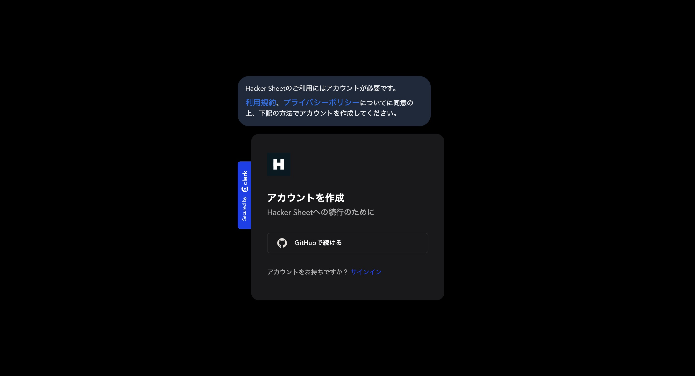
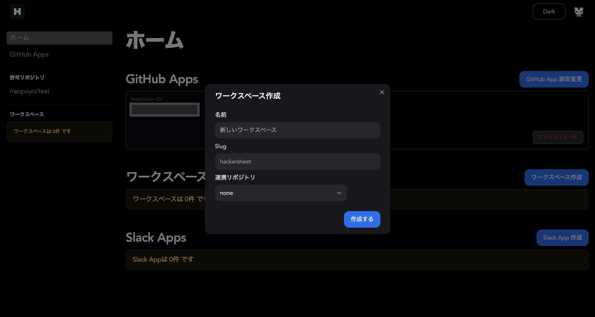
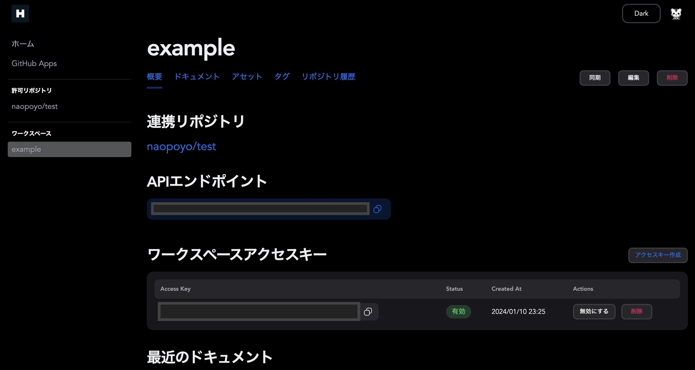

## この記事について

開発者向けのヘッドレスCMSを開発しています。サービス名は **Hacker Sheet** です。αテスト中ですが、簡単なブログサイトを構築するための機能は揃っています。下記のリンク先から利用可能です。

::link-card[https://hackersheet.com/]

この記事でHacker Sheetのサービス紹介と利用方法の解説をしていますので、興味を持たれた方はぜひ使ってみてください。

## サービスの概要

GitHubのリポジトリで管理しているMarkdown形式のファイルをまとめてGraphQL APIにします。これによって、API経由でWebサイトなどからコンテンツ情報を取得して表示することができるようになります。

## ココが便利

Hacker Sheetの便利なところをいくつか紹介します。

### コンテンツの更新をローカルのエディタで行える

VS Code、Vimなど使い慣れたエディタでMarkdownファイルを作成して、そのままGitHubリポジトリにpushすることでコンテンツの配信を行えます。WEB上の専用エディタを使用する必要がありません。VS Codeで記事を書いたあと、WEBエディタにコピペしなくても良いのです。

画像ファイルも同じようにpushすることでアップロード作業も必要なくなります。
また、Markdownパーサーに特別な処理を追加することで以下のようなファイルパス指定の記述で記事に画像を貼り付けることができるようになります。VS Codeには入力補完があるのでとても便利です。

```markdown

```

### Front Matter CMSを使えばもっと便利に

::link-card[https://frontmatter.codes/]

VS Codeの拡張機能である**Front Matter CMS**にも対応しています。この拡張機能を使って作成したコンテンツをそのまま公開可能です。

### Slack連携できる

リポジトリにpushした後、APIへの変換が完了した時にSlack通知される設定が可能です。エラーが発生した場合もSlackで確認できるため、サービスにログインする必要がありません。楽です。

## Hacker Sheetの使い方

1. GitHubアカウントを用意します
2. GitHubリポジトリを作成します
3. Hacker Sheetアカウントを作成します
4. GitHub Appをインストールします
5. ワークスペースを作成します
6. リポジトリにMarkdownのファイルをpushします

この手順でGraphQL APIでコンテンツデータを取得できるようになります。詳しく説明していきます。

### 1. GitHubアカウントを用意します

Hacker Sheetの利用にはGitHubアカウントが必要です。持っていない場合は作成します。

### 2. GitHubリポジトリを作成します

Hacker Sheet用に新しくGitHubのリポジトリを作成しておきます。ファイルはこの時点でpushする必要はありません。ファイルがすでに存在するリポジトリであっても問題ありません。

### 3. Hacker Sheetアカウントを作成します



https://hackersheet.com/ を開いて、「無料で使ってみる」をクリックするとサインアップページ(上記画像)に移動します。利用規約などを確認し、「GitHubで続ける」をクリックしてアカウントの作成を進めます。

### 4. GitHub Appをインストールします

Hacker Sheet用のGithub Appがあります。これをGitHubアカウントにインストールしてください。Hacker Sheetのダッシュボードの「GitHub Appインストール」ボタンをクリックするとインストール画面に移動することができます。


インストール画面(上記画像)では「Only select repositories」を選択して、手順2で作成したリポジトリのみを許可するようします。選択したリポジトリの読み取り許可がHacker Sheetに与えられます。

インストールが完了するとHacker Sheetのダッシュボードに表示されます。

### 5. ワークスペースを作成します



Hacker Sheetのダッシュボードからワークスペースを作成します。「ワークスペース作成」ボタンをクリックすると作成のためのダイアログが表示されます(上記画像)。必要な項目を入力して作成します。

- **名前**はダッシュボードで表示される管理用の名前です。好きな名前にします。
- **Slug**はAPIエンドポイントのURLになります。好きな文字列にします。
- **連携リポジトリ**に手順2で作成したリポジトリを選択します。

連携リポジトリを設定していないとpushしてもHacker Sheetにデータが取り込まれないため注意してください。

### 6. リポジトリにMarkdownのファイルをpushします

問題なくワークスペースが作成できたら、リポジトリにファイルをpushします。`.md` の拡張子のMarkdown形式のテキストファイルであればHacker Sheetにデータが取り込まれます。

テスト用に以下のような内容で作成してみても良いです。

```markdown:dialy.md
---
draft: false
emoji: 🌻
title: 日記
slug: diary
published_at: 1989-12-07 00:00:00
modified_at: 1989-12-07 00:00:00
tags:
  - 日記
preview: null
---

## 日記

今日はいい天気でした。
```

### 完了 🎉



これでGraphQLによるデータ取得が可能になります。Hacker Sheetのダッシュボードのサイドメニューからワークスペース詳細ページ(上記画像)に移動して、「APIエンドポイント」のURLと「ワークスペースアクセスキー」を控えてください。

`Authorization: Bearer <ワークスペースアクセスキー>` のようにAuthorization: Bearer ヘッダをセットしてAPIエンドポイントに対してリクエストすることでデータ取得が可能です。[Altair GraphQL Client](https://altairgraphql.dev/) などのクライアントを使って試してみてください。

使い方は以上になります。

## Hacker Sheetを使ったブログサイトの作成

::link-card[https://github.com/naopoyo/naopoyo-web]

Next.jsとHacker Sheetを使ってブログサイト(このサイトです)を作っています。上記GitHubリポジトリにてソースコードを公開しているので参考にして作ってみてください。
