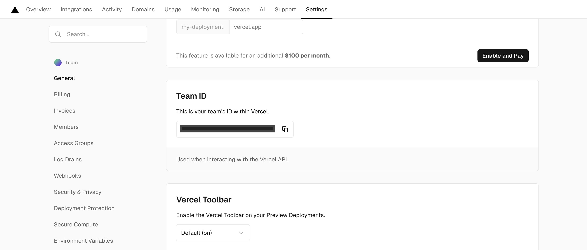
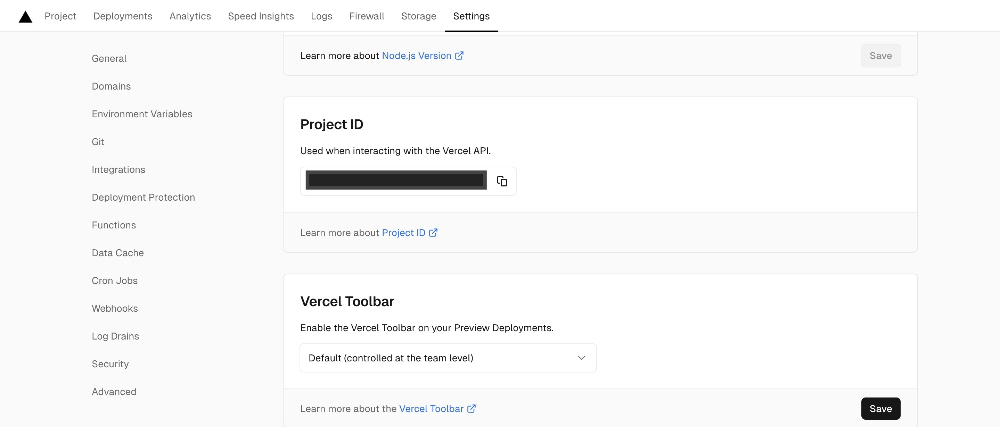

## この記事の概要

Vercelへのデプロイのトリガーを変更するための方法を紹介しています。

通常はmainブランチ（VercelのProduction Branchとして設定しているブランチ）へpushした時ですが、特定のタグ（例：`v1.0`）をpushした時にデプロイするように変更します。

## Vercelの自動デプロイの設定を無効化する

`vercel.json` はVercelのデフォルトの動作を設定、上書きするためのファイルです。このファイルへの設定追加でVercelの自動デプロイの設定を無効化します。

### vercel.jsonの例

vercel.jsonの `git.deploymentEnabled` を `false` にして自動デプロイを無効化します。

```json:vercel.json
{
  "$schema": "https://openapi.vercel.sh/vercel.json",
  "git": {
    "deploymentEnabled": false
  }
}
```

## GitHubにシークレットを追加

- `VERCEL_ORG_ID`
- `VERCEL_PROJECT_ID`
- `VERCEL_TOKEN`

これら3つの値をGitHubのシークレットとして追加します。

### `VERCEL_ORG_ID`

VercelのWEBの管理画面でTeamを選択して、「Settings」→「General」→「Team ID」の値を設定します。



### `VERCEL_PROJECT_ID`

VercelのWEBの管理画面でProjectを選択して、「Settings」→「General」→「Project ID」の値を設定します。



### `VERCEL_TOKEN`

VercelのWEBの管理画面で「Account Settings」→「Tokens」からトークンを作成して設定します。

## GitHub Actions ワークフローの定義

pnpmを使っている場合は、公式ドキュメントに書いてあるワークフローのyamlを以下のように書き換えましょう。

```yaml:.github/workflows/deploy.yaml
name: Vercel Deployment
env:
  VERCEL_ORG_ID: ${{ secrets.VERCEL_ORG_ID }}
  VERCEL_PROJECT_ID: ${{ secrets.VERCEL_PROJECT_ID }}
on:
  push:
    tags:
      - 'v*'
jobs:
  deploy-production:
    runs-on: ubuntu-latest
    steps:
      - name: Checkout
        uses: actions/checkout@v3
      - name: Install Node.js
        uses: actions/setup-node@v3
        with:
          node-version: 18
      - uses: pnpm/action-setup@v2
        name: Install pnpm
        id: pnpm-install
        with:
          version: 9
          run_install: false
      - name: Install Vercel CLI
        run: pnpm add --global vercel@latest
      - name: Pull Vercel Environment Information
        run: vercel pull --yes --environment=production --token=${{ secrets.VERCEL_TOKEN }}
      - name: Build Project Artifacts
        run: vercel build --prod --token=${{ secrets.VERCEL_TOKEN }}
      - name: Deploy Project Artifacts to Vercel
        run: vercel deploy --prebuilt --prod --token=${{ secrets.VERCEL_TOKEN }}
```

以上で、タグのpushでVercelのデプロイが可能になります。

## 参考

::link-card[https://vercel.com/guides/can-you-deploy-based-on-tags-releases-on-vercel]
::link-card[https://vercel.com/docs/projects/project-configuration]
::link-card[https://stackoverflow.com/questions/75037806/i-use-github-action-and-vercel-to-deploy-my-projectvitereactpnpm-to-vercel]
