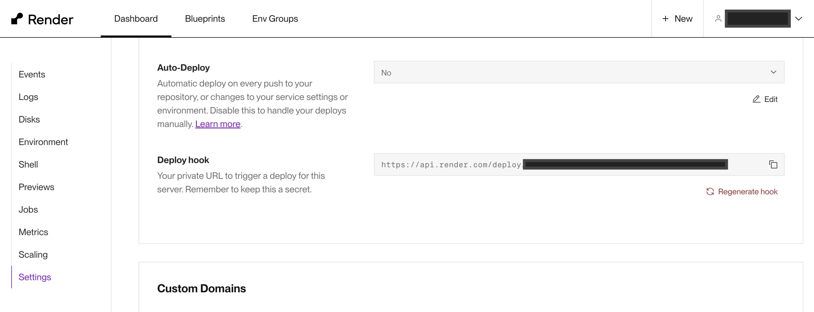

## この記事の概要

[Render](https://render.com/)へのデプロイのトリガーを変更するための方法を紹介しています。

通常はmainブランチ（Build & DeployのBranchで設定しているブランチ）へpushした時ですが、特定のタグ（例：`v1.0`）をpushした時にデプロイするように変更します。

## Renderの設定を変更する

RenderのWEBのダッシュボードでサービスを選択して「Settings」→「Build & Deploy」→「Auto-Deploy」の設定を「No」に変更します。

また、「Settings」→「Build & Deploy」→「Deploy hook」の内容を控えておきます。

## GitHubにシークレットを追加

`RENDER_DEPLOY_HOOK_URL` というシークレットを追加して、前述の「Deploy hook」の内容を設定します。



## GitHub Actions ワークフローの定義

以下のようにワークフローを定義します。

```yaml:.github/workflows/deploy.yaml
name: Deployment
on:
  push:
    tags:
      - "v*"
jobs:
  deploy-server-production:
    runs-on: ubuntu-latest
    steps:
      - name: Deploy Server
        env:
          deploy_url_server: ${{ secrets.RENDER_DEPLOY_HOOK_URL }}
        run: |
          curl "$deploy_url_server"
```

以上で、タグのpushでRenderのデプロイが可能になります。

## 参考

::link-card[https://docs.render.com/deploy-hooks]
::link-card[https://zenn.dev/na_it_o/articles/cb7d0b9496496d]
::link-card[https://qiita.com/qualitia_cdev/items/407b0df9c0a0f0f45bbc]
