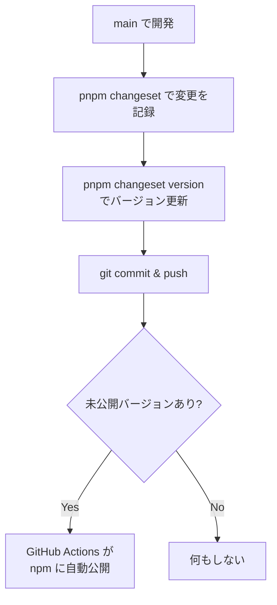

## はじめに

モノレポで複数パッケージを管理していると、依存関係のあるパッケージを正しい順序で公開するのが面倒になります。Changesets を使えば、この問題を解決できます。

## モノレポのリリースで起きる問題

例えば、以下のような依存関係があるとします。

```text
@example/cli → @example/core
@example/react-components → @example/core
```

`@example/core` に破壊的変更を加えた場合、

1. `core` のバージョンを上げる
2. `cli` と `react-components` の依存バージョンを更新する
3. `cli` と `react-components` のバージョンも上げる
4. 正しい順序（`core` → `cli` → `react-components`）で公開する

手動でやると、どこかで必ずミスします。

## Changesets とは

[Changesets](https://github.com/changesets/changesets) は、モノレポのバージョン管理とリリースに特化したツールです。

**主な機能：**

- 変更内容を「changeset ファイル」として記録
- 依存パッケージのバージョンを自動更新
- CHANGELOG を自動生成
- GitHub Actions と連携した自動リリース

## 導入手順

### 1. インストール

```bash
pnpm add -DEw @changesets/cli
```

### 2. 初期化

```bash
pnpm changeset init
```

`.changeset/config.json` が作成されます。

```json:.changeset/config.json
{
  "$schema": "https://unpkg.com/@changesets/config@3.1.1/schema.json",
  "changelog": "@changesets/cli/changelog",
  "commit": false,
  "fixed": [],
  "linked": [],
  "access": "public",
  "baseBranch": "main",
  "updateInternalDependencies": "patch",
  "ignore": []
}
```

### 3. 設定のカスタマイズ

アルファ版開発向けの推奨設定は以下のようにします。

```json:.changeset/config.json
{
  "$schema": "https://unpkg.com/@changesets/config@3.1.1/schema.json",
  "changelog": "@changesets/cli/changelog",
  "commit": false,
  "fixed": [],
  "linked": [],
  "access": "public",
  "baseBranch": "main",
  "updateInternalDependencies": "patch",
  "ignore": ["@example/sandbox-*"],
  "privatePackages": {
    "version": false,
    "tag": false
  }
}
```

| 設定                         | 説明                                                    |
| ---------------------------- | ------------------------------------------------------- |
| `access: "public"`           | scoped パッケージを public で公開                       |
| `updateInternalDependencies` | 依存パッケージの更新方法（`patch` / `minor` / `major`） |
| `ignore`                     | バージョン管理対象外のパッケージ                        |
| `privatePackages`            | private パッケージの扱い                                |

## 日常のワークフロー

この記事の GitHub Actions の設定の場合に行う日常のワークフローです。

### 変更を記録する

機能追加やバグ修正をしたら、コミット前に changeset を作成します。

```bash
pnpm changeset
```

対話形式で以下を入力します。

1. **変更したパッケージを選択**（スペースで選択、Enter で確定）
2. **バージョンの種類を選択**（major / minor / patch）
3. **変更の概要を入力**

`.changeset/` 以下に markdown ファイルが生成されます。

```markdown
---
'@example/core': minor
'@example/cli': patch
---

Added new validation API to core package
```

> [!TIP]
> changeset ファイルはコードと一緒にコミットします。

### 変更をコミット・プッシュ

changeset ファイルと変更したコードを一緒にコミットします。

```bash
git add .
git commit -m "feat: add new validation API"
git push
```

### バージョンを更新する

リリース準備ができたら、次のコマンドを実行します。

```bash
pnpm changeset version
```

このコマンドは

1. すべての changeset ファイルを読み込む
2. 各パッケージの `package.json` のバージョンを更新
3. 依存パッケージのバージョンも自動更新
4. `CHANGELOG.md` を生成・更新
5. 処理済みの changeset ファイルを削除（prerelease モードでは削除されない）

### リリースをコミット・プッシュ

```bash
git add .
git commit -m "chore: release"
git push
```

コミット & プッシュ で自動的に npm に公開されます。

#### 日常の操作（簡易版）

```bash
# 1. コードを変更

# 2. 変更を記録
pnpm changeset

# 3. 変更をコミット & プッシュ
git add .
git commit -m "chore: release"
git push

# 4. バージョン更新（CHANGELOG も生成される）
pnpm changeset version

# 5. リリースをコミット & プッシュ （
git add .
git commit -m "chore: release"
git push
```

## GitHub Actions との連携

Changesets の真価は CI/CD 連携で発揮されます。

### シンプルフロー（個人・小規模開発向け）

main ブランチで直接作業し、push したら自動で公開されるシンプルなフローです。



#### ワークフローの設定

ワークフローを2つのジョブに分けて、未公開パッケージがあるときだけビルド・公開を実行します。

<details>

<summary>GitHub Actions の設定を見る</summary>

```yaml:.github/workflows/release.yml
name: Release

on:
  push:
    branches:
      - main

concurrency: ${{ github.workflow }}-${{ github.ref }}

jobs:
  check:
    name: Check for unpublished packages
    runs-on: ubuntu-latest
    outputs:
      has_unpublished: ${{ steps.check.outputs.has_unpublished }}
    steps:
      - name: Checkout
        uses: actions/checkout@v4

      - name: Setup pnpm
        uses: pnpm/action-setup@v4

      - name: Setup Node.js
        uses: actions/setup-node@v4
        with:
          node-version: '24'

      - name: Check unpublished packages
        id: check
        run: |
          HAS_UNPUBLISHED=false
          for dir in packages/*/; do
            if [ -f "$dir/package.json" ]; then
              PKG_NAME=$(jq -r .name "$dir/package.json")
              PKG_VERSION=$(jq -r .version "$dir/package.json")
              # Skip sandbox packages
              if [[ "$PKG_NAME" == *"sandbox"* ]]; then
                continue
              fi
              if ! npm view "$PKG_NAME@$PKG_VERSION" version 2>/dev/null; then
                echo "Unpublished: $PKG_NAME@$PKG_VERSION"
                HAS_UNPUBLISHED=true
              fi
            fi
          done
          echo "has_unpublished=$HAS_UNPUBLISHED" >> $GITHUB_OUTPUT

  release:
    name: Release
    needs: check
    if: needs.check.outputs.has_unpublished == 'true'
    runs-on: ubuntu-latest
    permissions:
      contents: write
      id-token: write
    steps:
      - name: Checkout
        uses: actions/checkout@v4

      - name: Setup pnpm
        uses: pnpm/action-setup@v4

      - name: Setup Node.js
        uses: actions/setup-node@v4
        with:
          node-version: '24'
          cache: 'pnpm'
          registry-url: 'https://registry.npmjs.org'

      - name: Install dependencies
        run: pnpm install --frozen-lockfile

      - name: Build packages
        run: pnpm build:packages

      - name: Publish to npm
        id: changesets
        uses: changesets/action@v1
        with:
          publish: pnpm run release
          createGithubReleases: true
        env:
          GITHUB_TOKEN: ${{ secrets.GITHUB_TOKEN }}

      - name: Summary
        if: steps.changesets.outputs.published == 'true'
        run: |
          echo "## Published successfully! :rocket:" >> $GITHUB_STEP_SUMMARY
          echo "" >> $GITHUB_STEP_SUMMARY
          echo "### Packages" >> $GITHUB_STEP_SUMMARY
          echo '${{ steps.changesets.outputs.publishedPackages }}' | jq -r '.[] | "- **\(.name)@\(.version)** - [npm](https://www.npmjs.com/package/\(.name))"' >> $GITHUB_STEP_SUMMARY
          echo "" >> $GITHUB_STEP_SUMMARY
          echo "- **Tag:** alpha" >> $GITHUB_STEP_SUMMARY
          echo "- **Auth:** Trusted Publishing (OIDC)" >> $GITHUB_STEP_SUMMARY
```

> [!TIP]
> `check` ジョブで未公開パッケージの有無を先にチェックすることで、通常のコミットでは重いビルド処理をスキップできます。

</details>

#### リリーススクリプト

`package.json` にリリーススクリプトを追加します。

```json:package.json
{
  "scripts": {
    "release": "./scripts/release.sh"
  }
}
```

スクリプトファイルを作成します。

```bash:scripts/release.sh
#!/bin/bash
set -euo pipefail

# Publish packages that have not been published yet
# Used by changesets/action in GitHub Actions

ROOT_DIR=$(pwd)
PACKAGES=$(pnpm -r --filter '@example/*' --filter '!@example/sandbox-*' exec pwd)
PUBLISHED=""

for dir in $PACKAGES; do
  cd "$dir"

  PKG_NAME=$(jq -r .name package.json)
  PKG_VERSION=$(jq -r .version package.json)

  if npm view "$PKG_NAME@$PKG_VERSION" version 2>/dev/null; then
    echo "Skip: $PKG_NAME@$PKG_VERSION (already published)"
  else
    echo "Publish: $PKG_NAME@$PKG_VERSION"
    pnpm pack
    npm publish *.tgz --access=public --tag alpha --provenance
    rm -f *.tgz

    if [ -n "$PUBLISHED" ]; then
      PUBLISHED="$PUBLISHED,$PKG_NAME@$PKG_VERSION"
    else
      PUBLISHED="$PKG_NAME@$PKG_VERSION"
    fi
  fi
done

cd "$ROOT_DIR"

echo ""
echo "Published packages: ${PUBLISHED:-none}"

# Create git tags for changesets/action to detect and create GitHub releases
if [ -n "$PUBLISHED" ]; then
  pnpm changeset tag
fi
```

> [!NOTE]
>
> - `npm view` で公開済みかどうかをチェックし、未公開のパッケージだけを publish します
> - 末尾で `pnpm changeset tag` を実行することで、`changesets/action` が git タグと GitHub リリースを自動作成します
> - `changesets/action` の `publishedPackages` 出力を使ってサマリー表示に利用できます

## アルファ版リリースのワークフロー

正式リリース前のアルファ版は、別のフローで管理するのが一般的です。

### prerelease モードに入る

```bash
pnpm changeset pre enter alpha
```

このモードでは、`pnpm changeset version` を実行すると：

- `1.0.0` → `1.0.1-alpha.0`
- `1.0.1-alpha.0` → `1.0.1-alpha.1`

のようにアルファ版としてバージョンが上がります。

### prerelease モードを終了する

正式リリースの準備ができたら：

```bash
pnpm changeset pre exit
```

次の `version` コマンドで正式バージョン（`1.0.1`）になります。

## まとめ

Changesets を導入することで：

- **依存関係の追跡が自動化**される
- **CHANGELOG が自動生成**される
- **公開順序のミスがなくなる**

最初の設定は少し手間ですが、パッケージが増えるほど効果を発揮します。

## 参考リンク

- [Changesets GitHub](https://github.com/changesets/changesets)
- [Changesets ドキュメント](https://github.com/changesets/changesets/blob/main/docs/intro-to-using-changesets.md)
- [changesets/action](https://github.com/changesets/action)
