## 概要

::link-card[https://github.com/lukilabs/beautiful-mermaid]

beautiful-mermaid で出力するようにしてみたので、サンプルを色々作ってみた。

## Mermaid サンプル1 - フローチャート

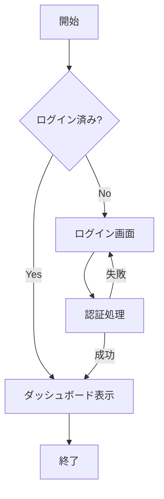

## Mermaid サンプル2 - シーケンス図

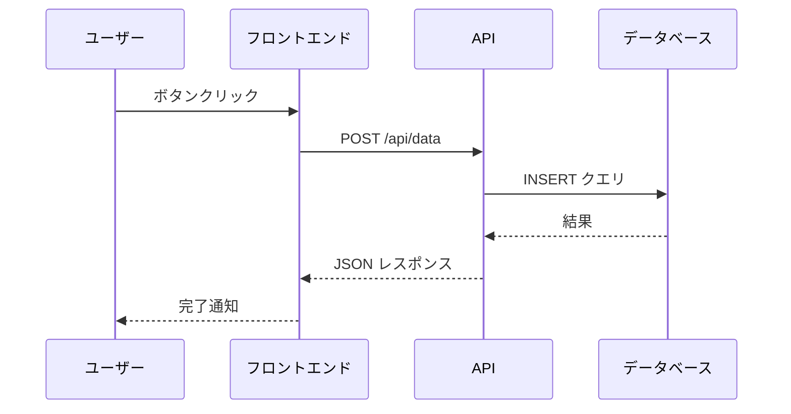

## Mermaid サンプル3 - クラス図

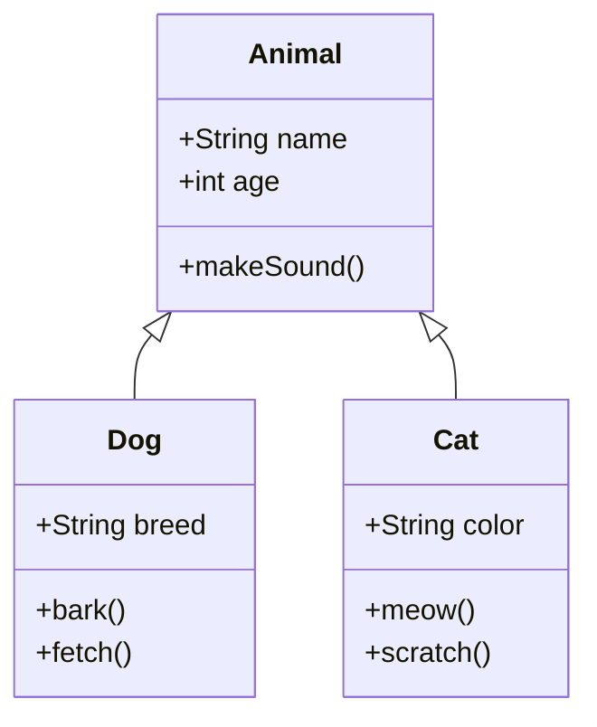

## Mermaid サンプル4 - 状態遷移図

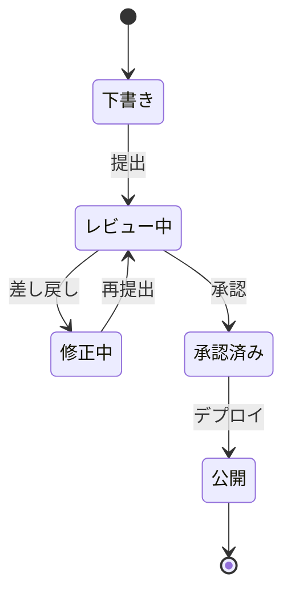

## Mermaid サンプル5 - ER図

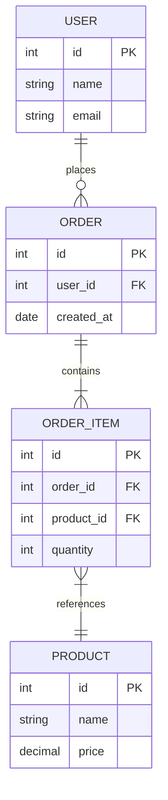

## Mermaid サンプル6 - ガントチャート

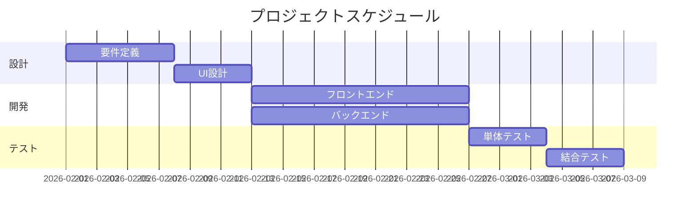

## Mermaid サンプル7 - 円グラフ

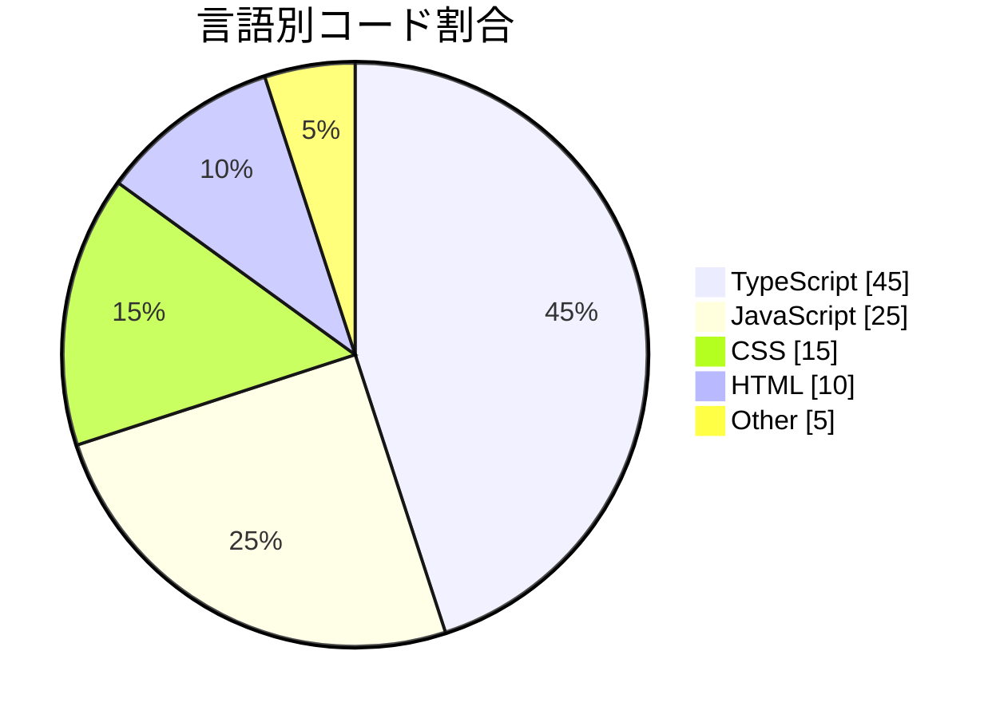

## Mermaid サンプル8 - Gitグラフ

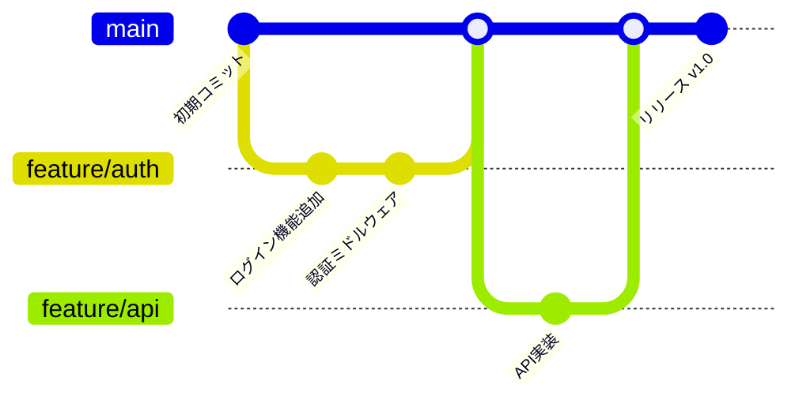

## Mermaid サンプル9 - マインドマップ

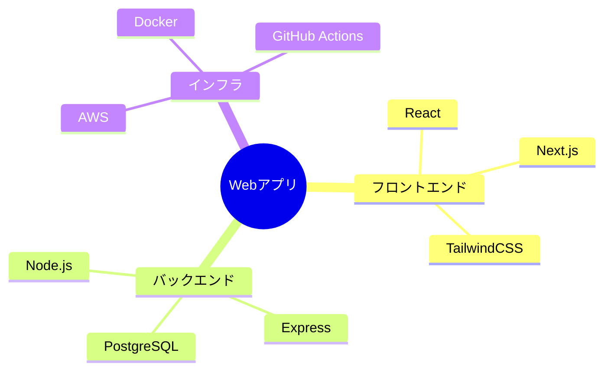

## Mermaid サンプル10 - タイムライン

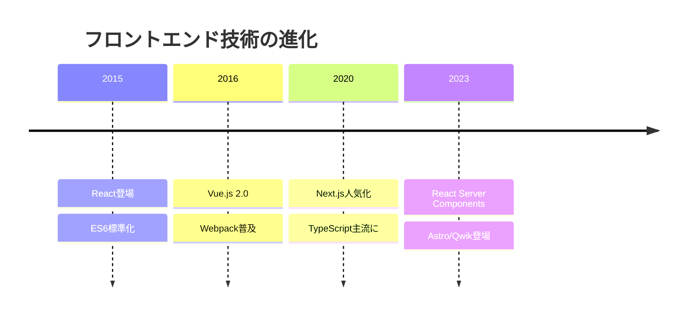

## Mermaid サンプル11 - ユーザージャーニー図

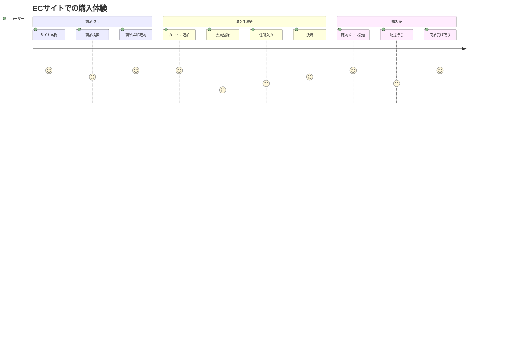

## Mermaid サンプル12 - 象限チャート

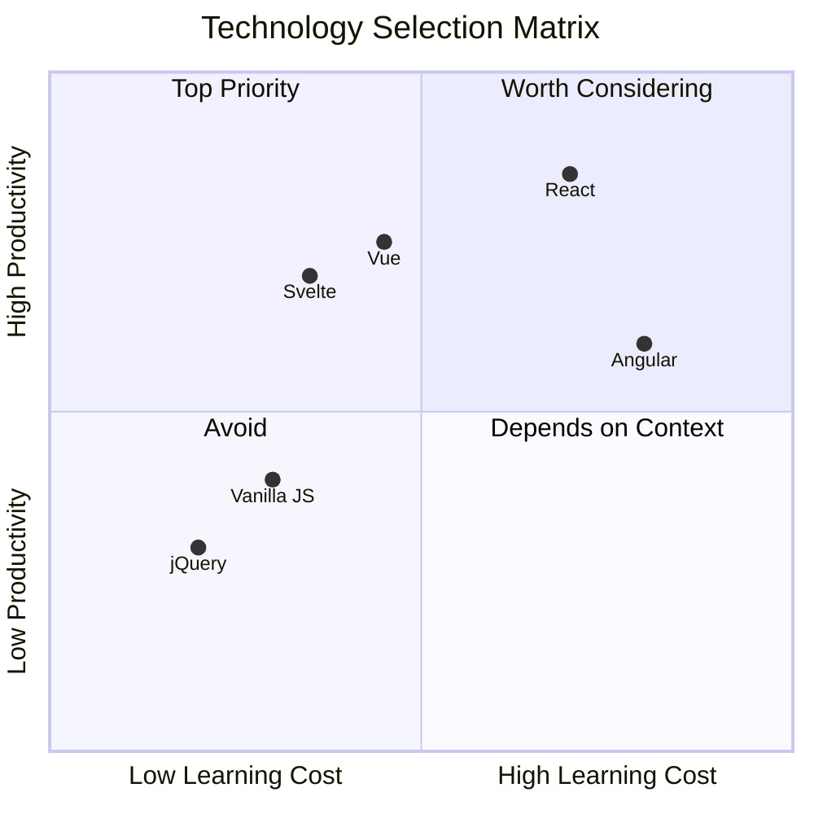

## Mermaid サンプル13 - XYチャート

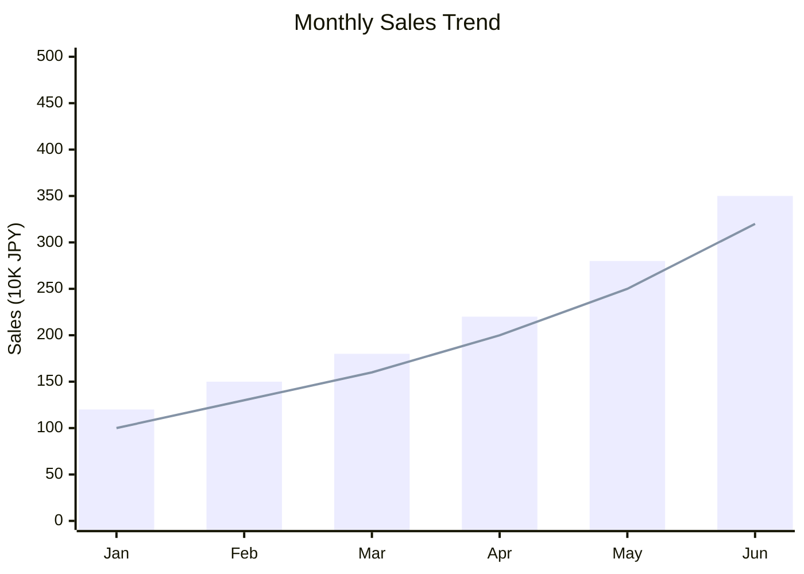

## Mermaid サンプル14 - サンキー図

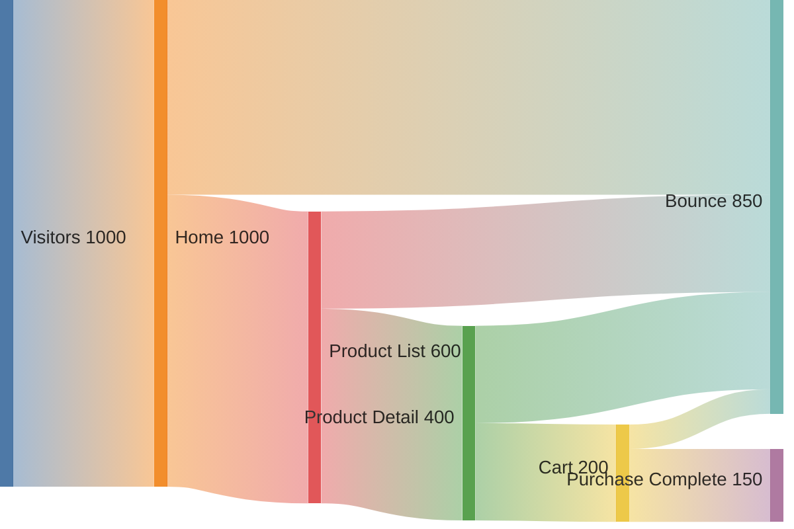

## Mermaid サンプル15 - ブロック図

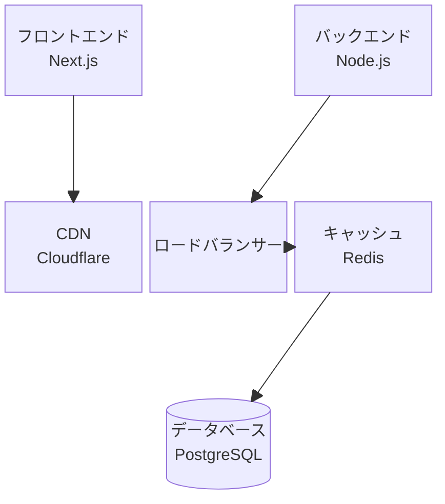

## Mermaid サンプル16 - 要件図

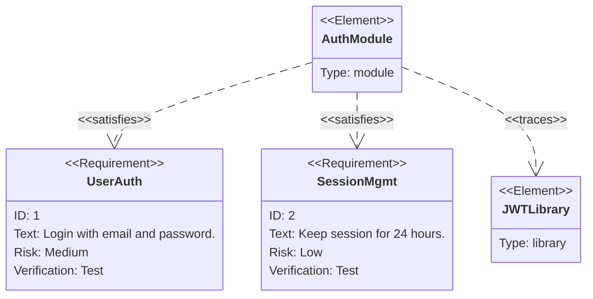
